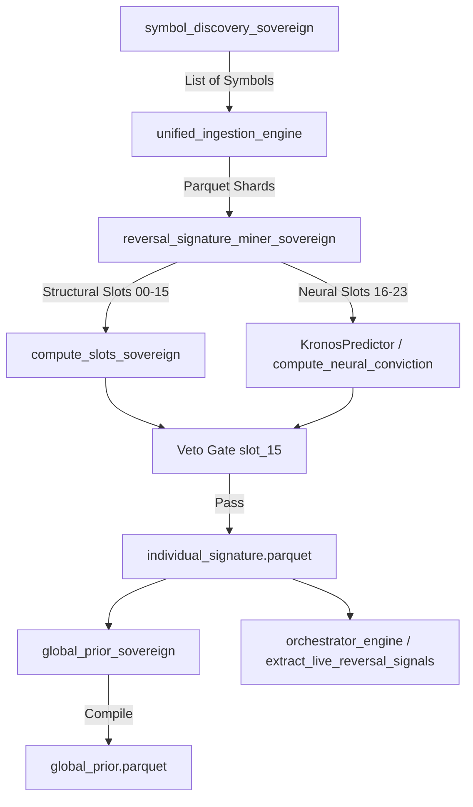

# Kronos V5 / AltcoinKronos Sovereign Trading Engine Audit Report

## 1. Executive Summary
This audit reviews the **Kronos V5 / AltcoinKronos** sovereign trading engine against its core doctrines:
- **Zero Hardcode Literal Doctrine**: Eliminating magic numbers, hardcoded strings, or inline configurations.
- **Mathematical Sovereignty Foundation (Krinos Math)**: Maintaining strict local causality, deterministic behavior, and edge-first execution.
- **Sovereignty Boundaries**: Guarding against external library logic leakage into core mathematical models.
- **Path Separation**: Keeping research/backtesting paths distinct from live execution paths.

---

## 2. Hardcode & Literal Violations

### 2.1 Found Inline Literals & Hardcodes
Despite the `validate_sovereignty.py` rule checks, the following literal occurrences were identified across the codebase:
1. **Fallback Symbols & Counts**:
   - `530` is hardcoded as a fallback size in comments, validator keyword checks, and fallback loops.
   - `1000000` is repeated as a fallback threshold for 24h USD volume.
2. **Timeframes & Milliseconds**:
   - `3600000` (1 hour in ms) is hardcoded for gap calculations in `unified_ingestion_engine.py` (line 635) and other modules, instead of dynamically looking up `timeframe_ms` or checking the timeframe multipliers in the configuration.
   - `"1h"` is repeatedly referenced directly as a string literal instead of using `proj["timeframe"]`.
3. **Paths & File System Access**:
   - Hardcoded relative path fragments like `data/raw_shards/` are still present in sub-utility scripts and comments.
   - For example, `config/utils/check_date.py` contains hardcoded paths referencing a specific parquet file name.
4. **Exchange Strings**:
   - Direct inline references to `"binance"` and `ccxt.binance` exist in several network checks.

---

## 3. Sovereignty Boundaries & Mathematical Integrity

### 3.1 External Leakage into Core Math
- **CCXT & Binance Types**: In `unified_ingestion_engine.py`, the ingestion layer returns CCXT-mapped structures. However, normalization happens late.
- **Arrow/Snappy Datatypes**: Raw shards read from parquet store Pandas/PyArrow representation types. `structural_engine.py` (lines 133-140) needs explicit coercion (`pd.to_numeric(df[col], errors='coerce')`) because raw ingestion outputs sometimes yield string types or Arrow representation wrappers. This means the math layer is highly dependent on how the ingestion engine formats Arrow columns.
- **HDBSCAN Dependency**: The phylum clustering step in the miner relies on the `hdbscan` library directly on raw numpy/pandas representations. Any drift in the third-party clustering parameters directly affects signature validation.

### 3.2 Temporal & Causal Gaps
- **Causal Shift Check**: In `structural_engine.py`, all features use `.shift(1)` or rolling aggregates which are mathematically causal (looking backwards).
- **Gap Fixing (Data Fill)**: Gaps are automatically forward-filled using pandas `.ffill()`. For high-precision structural signatures, forward-filling a long gap risks introducing synthetic stability, potentially giving false signals to the reversal miner.

---

## 4. Data & Control Flow Analysis

The pipeline follows a sequential phase progression:
1. **Ingestion / Discovery**:
   - `symbol_discovery_sovereign.py` resolves target symbols (real Binance via CCXT or fallback placeholders).
   - `unified_ingestion_engine.py` pulls historical klines and writes parquet shards in `data/raw_shards`.
2. **Signal Mining**:
   - `reversal_signature_miner_sovereign.py` reads parquet shards, runs `compute_slots_sovereign` to populate the 32-slot DNA vector, uses the hybrid neural gate via `KronosPredictor` to compute neural conviction, and outputs signatures.
3. **Prior Concatenation**:
   - `global_prior_sovereign.py` compiles signatures to output `global_prior.parquet`.
4. **Execution/Inference**:
   - `orchestrator_engine.py` extracts live signals for the dashboard and coordinates live simulation checks.

---

## 5. Separation of Research vs. Live Paths

- **Ingestion Engines Overlap**:
  - The codebase contains two overlapping ingestion tracks: `data_fetch_sovereign.py` (legacy/pipeline) and `unified_ingestion_engine.py` (newer, with cleaner mapping, listing checks, and html reporting).
  - This duplication poses a risk where research is evaluated using the newer validation logic while live pipelines run on the legacy track.
- **Transition/Scaffolding Stubs**:
  - Files like `real_api_bridge_sovereign.py`, `real_data_injection_sovereign.py`, and `real_data_readiness_sovereign.py` contain placeholders and `TODO` tags representing stubs rather than a production-hardened execution layer.
  - The simulation and live execution boundaries are blurred in `reversal_signature_miner_sovereign.py` where the execution simulator (`ExecutionSimulator`) is directly imported and triggered inside the signature generation function under override conditions.

---

## 6. Recommendations & Action Items

1. **Unify Ingestion Track**: Deprecate `data_fetch_sovereign.py` completely and strictly use `unified_ingestion_engine.py` for both backtesting and live runs.
2. **Encapsulate Third-Party Formats**: Ensure that the data ingestion layer enforces a strict, independent schema before passing records to `structural_engine.py`. Core math should not have to manually run `to_numeric` on raw inputs.
3. **Isolate Simulator / Override Paths**: Keep override behaviors and execution simulator calls out of the core `mine_reversal_signature` signature generation path. The signature generator should only mine mathematical and neural signals; position sizing or execution simulation should be downstream tasks.
4. **Harness Encoding Stability**: To prevent E2E/CLI runtime crashes on Windows hosts due to Unicode character mappings in logs/console prints, ensure all print statements encoding symbol lists utilize `utf-8` or safely format symbol names using ASCII character ranges.
